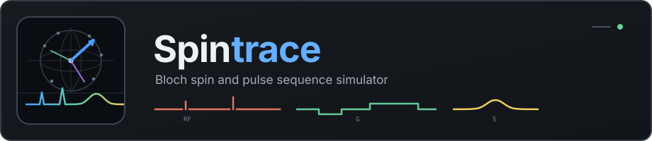
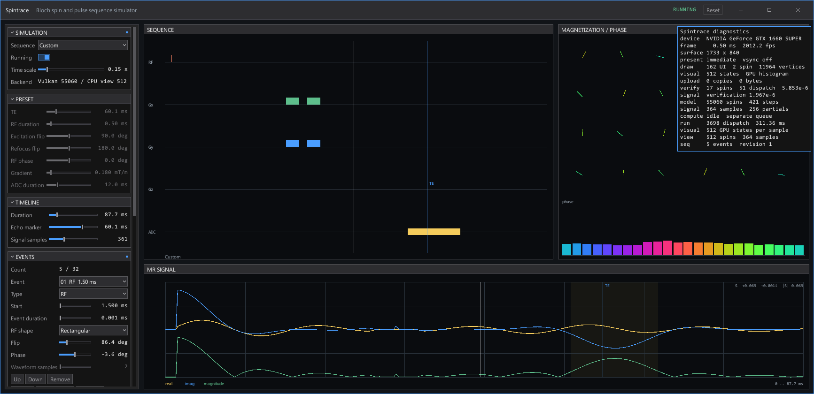
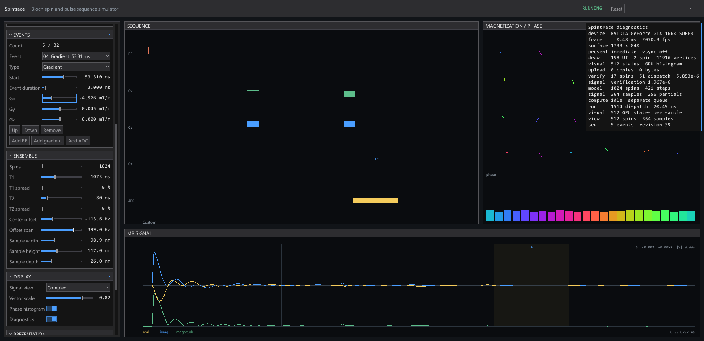
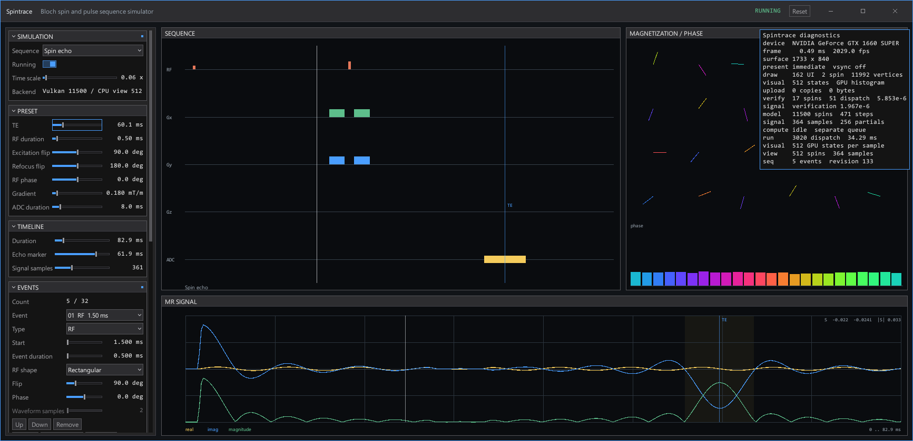
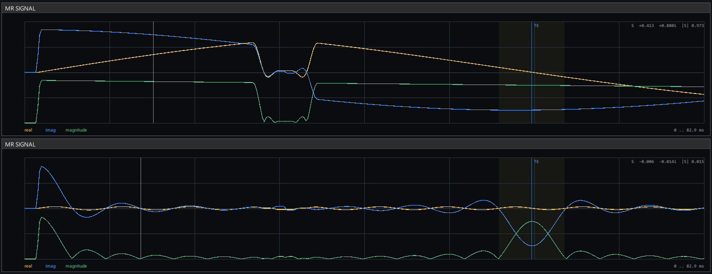

<p align="center">
  
</p>

# Spintrace

Spintrace is a Windows application for simulating Bloch spin ensembles and magnetic resonance pulse sequences. Vulkan Compute integrates the spin state and reduces the complex MR signal. Vulkan Graphics renders the interface, magnetization vectors, phase distribution and signal traces.

## Features

- Spin ensemble: independent isochromats defined by 3D position, equilibrium magnetization, T1, T2, off-resonance offset, and receiver weight.
- Bloch integration: rotating-frame solver using analytic free precession for relaxation intervals and symmetric operator splitting with Rodrigues rotation during RF pulses.
- RF waveforms: finite rectangular, Gaussian, and windowed sinc envelopes with flip angle, phase, duration, and area-normalized sampling controls.
- Sequence editor: absolute timeline supporting up to 32 overlapping RF, three-axis gradient (Gx, Gy, Gz), and ADC acquisition events, with presets for spin echo and gradient echo.
- Vulkan compute: asynchronous execution for spin state evolution, signal mapping, and multi-stage parallel pair reduction without floating-point atomics.
- State display: direct GPU rendering of transverse magnetization vectors and a 24-bin phase distribution histogram.
- Signal display: complex MR signal inspection with selectable real, imaginary, magnitude, and ADC-acquired views.
- Validation: embedded CPU reference integrator with automated startup checks verifying GPU state and reduction output against analytic models.
- Platform: Win32 application implemented with the Rust standard library without external dependencies, featuring runtime SPIR-V assembly, per-monitor DPI scaling, swapchain presentation controls, and INI state persistence.



## Interface

The window uses application-rendered chrome and a custom border. The central workspace is divided into three data views.

- Sequence displays RF, Gx, Gy, Gz and ADC events on a common time axis.
- Magnetization / Phase displays transverse spin vectors and a phase histogram.
- MR Signal displays the complex or magnitude signal over the sequence duration.

The side panel contains simulation, preset, timeline, event, ensemble, display and presentation controls. Sections can be collapsed independently.

The sequence selector provides `Spin echo`, `Gradient echo` and `Custom`. Editing an event or the custom timeline changes the active sequence to `Custom`. Selecting a preset rebuilds its event list from the current preset parameters.

Numeric values can be changed by dragging, using the mouse wheel, using the arrow keys or double-clicking the value field and entering a number. Slider modifiers change pointer sensitivity.

- Shift applies fine adjustment.
- Ctrl applies coarse adjustment.
- Shift and Ctrl apply extra-fine adjustment.
- Page Up and Page Down move a focused slider by ten display steps.
- Tab moves keyboard focus through interactive controls.
- Enter commits a text or numeric field.
- Escape cancels the active text edit or closes a list.

## Pulse sequence editor

A sequence is an ordered collection of events on an absolute time axis. Execution order is determined by event time. The list order controls presentation and serialization.

Events may overlap. RF fields and gradient fields are summed over every interval where their events overlap. ADC events mark observations as acquired without changing the effective field.

| Event | Parameters |
|---|---|
| RF | start, duration, flip angle, phase, waveform shape, waveform samples |
| Gradient | start, duration, Gx, Gy, Gz |
| ADC | start, duration |

Supported RF envelopes:

- Rectangular uses a constant amplitude.
- Gaussian samples a centered Gaussian envelope.
- Sinc samples a windowed sinc envelope with signed side lobes.

Every sampled waveform is normalized by its signed area before conversion to B1. The integrated on-resonance rotation therefore matches the requested flip angle.

The editor supports adding, removing and reordering events. A sequence may contain up to 32 events. Multiple ADC blocks and empty sequences are valid.



## Physical model

Each spin packet stores

$$
\mathbf{r}_j = (x_j, y_j, z_j),
\qquad
\mathbf{M}_j = (M_{x,j}, M_{y,j}, M_{z,j}),
$$

together with $M_{0,j}$, $T_{1,j}$, $T_{2,j}$, angular frequency offset $\Delta\omega_j$ and receiver weight $w_j$.

The simulation runs in the rotating frame. For a piecewise constant RF field and gradient, the effective angular frequency is

$$
\boldsymbol{\Omega}_j(t) =
\begin{pmatrix}
\gamma B_{1x}(t) \\
\gamma B_{1y}(t) \\
\Delta\omega_j + \gamma\,\mathbf{G}(t)\cdot\mathbf{r}_j
\end{pmatrix}.
$$

The implemented Bloch equation is

$$
\frac{d\mathbf{M}_j}{dt} = \mathbf{M}_j \times \boldsymbol{\Omega}_j +
\begin{pmatrix}
-M_{x,j}/T_{2,j} \\
-M_{y,j}/T_{2,j} \\
(M_{0,j}-M_{z,j})/T_{1,j}
\end{pmatrix}.
$$

The sign convention gives

$$
M_x+iM_y \propto e^{-i\Omega_z t}
$$

for positive longitudinal angular frequency.

The default proton gyromagnetic ratio is

$$
\gamma = 2.6752219\times 10^8\ \mathrm{rad\,s^{-1}\,T^{-1}}.
$$

The received complex signal is

$$
S(t_k) =
\sum_j w_j
\left(
M_{x,j}(t_k)+iM_{y,j}(t_k)
\right).
$$

Receiver weights are normalized to sum to one, so signal amplitude does not scale with the selected spin count.

T2 star is produced by intrinsic T2 relaxation and the off-resonance distribution. It is not stored as an independent spin parameter.

## Ensemble generation

Spin positions and material parameters are generated deterministically with low-discrepancy Halton coordinates.

- Position is distributed over a rectangular sample volume.
- Frequency offset is distributed around the selected center offset.
- T1 and T2 spreads are symmetric relative ranges around their selected central values.
- Every prefix of the generated sequence remains spatially distributed.
- Repeating a configuration produces the same ensemble.

The full Vulkan model supports up to 1,048,576 spins. The CPU preview uses a bounded 512-spin ensemble to provide immediate feedback while a new GPU model is being submitted.

## Numerical integration

Intervals without transverse RF use an analytic free-precession update:

$$
M_{xy}(t+\Delta t) = M_{xy}(t) e^{-\Delta t/T_2} e^{-i\Omega_z\Delta t},
$$

$$
M_z(t+\Delta t) = M_0 + \left(M_z(t)-M_0\right)e^{-\Delta t/T_1}.
$$

Intervals containing RF use symmetric operator splitting:

- Apply half of the relaxation interval.
- Rotate exactly around the complete effective field with Rodrigues rotation.
- Apply the remaining half of the relaxation interval.

RF waveform samples are divided further when an interval exceeds the integration step limit. CPU and Vulkan backends consume the same compiled field steps.

## Echo sequences

The spin echo preset contains an excitation pulse, a refocusing pulse, gradient events and an ADC window centered near the selected echo time.

For static off-resonance and an ideal refocusing pulse, phase dispersion reverses after the refocusing pulse. The transverse signal reaches a local maximum near TE while its envelope remains limited by T2 decay.



The gradient echo preset contains an excitation pulse, a prephasing gradient and a readout gradient. The readout amplitude is selected so the longitudinal gradient moment returns to zero at the echo marker.

Static frequency offsets continue accumulating phase during a gradient echo. Increasing the offset span therefore suppresses the echo even when the applied gradient moment is balanced.



## Vulkan compute path

The compute backend contains four main pipelines.

- `spin_reset` initializes every state to $(0, 0, M_0)$.
- `spin_evolve` applies one compiled Bloch field step.
- `signal_map` writes the weighted complex contribution of every spin.
- `signal_reduce` adds adjacent complex contributions into progressively smaller buffers.

Spin storage is padded to a power of two and to complete compute workgroups. Padded records use zero equilibrium magnetization and zero receiver weight.

Signal reduction stops at no more than 256 partial complex sums per observation. These partials are copied to mapped memory and completed on the CPU after the compute fence signals. Floating-point atomic extensions are not required.

A simulation request records the complete sequence into one command buffer. The request is submitted without blocking the application loop. The result is accepted only when its physical configuration and sequence revision still match the current editor state.

When the graphics queue family exposes multiple queues, compute uses the second queue. Devices exposing one suitable queue use the same queue for graphics, compute and presentation.

## Vulkan graphics path

Ordinary interface geometry is accumulated in indexed `DrawList` buffers. Each frame contains a base layer and a top layer.

The render order is

```text
base interface
magnetization vectors
phase histogram
popup and diagnostic layer
window border
```

A selected GPU-produced state snapshot is copied into a frame-local storage buffer after that frame slot fence signals.

The vector pipeline reads magnetization from the storage buffer and emits line instances directly. The phase histogram compute pipeline clears and fills 24 bins before the render pass. The histogram graphics pipeline reads those bins and emits procedural bars.

The visualization uses up to 512 spin states per observation and draws 24 representative vectors. The complete spin count remains active in signal generation.

## Presentation

Supported presentation preferences are `Auto`, `FIFO`, `FIFO relaxed`, `Mailbox` and `Immediate`.

`Auto` uses the VSync setting:

- VSync enabled selects FIFO.
- VSync disabled prefers Mailbox, then Immediate, then FIFO.

An explicit mode is requested directly. If the surface does not support it, the renderer logs the condition and follows the automatic fallback path. The active swapchain mode is shown in the interface and diagnostic overlay.

The frame limiter is independent of swapchain presentation. A value of zero disables the limiter.

Per-monitor DPI awareness is enabled before window creation. Interface metrics and font size are multiplied by the current monitor scale.

## Configuration

`spintrace.ini` stores construction settings and mutable application state. Unknown keys and unknown sections are preserved when the file is saved. Generated `event.N` sections are replaced from the current event list.

The main sections are:

| Section | Contents |
|---|---|
| `window` | restored client size and maximized state |
| `render` | Vulkan device, swapchain, validation and buffer settings |
| `font` | font paths, atlas size and coverage gamma |
| `simulation` | sequence type, spin count, sample count and playback |
| `ensemble` | relaxation, off-resonance and sample dimensions |
| `sequence` | preset parameters and custom timeline metadata |
| `display` | plot mode, visualization and interface scale |
| `appearance` | colours, dimensions and GUI behavior |
| `event.N` | one editable RF, gradient or ADC event |

A representative custom configuration follows.

## Memory use

For a padded spin capacity $N$, the primary compute buffers occupy approximately

$$
N(32 + 16 + 16 + 16) = 80N\ \mathrm{bytes}.
$$

The terms are spin parameters, spin state and two reduction buffers. At $N=1{,}048{,}576$, these buffers occupy approximately 80 MiB.

Readback storage depends on the observation count $K$:

$$
K(P\cdot16 + V\cdot16),
$$

where $P\leq256$ is the number of signal partials and $V\leq512$ is the number of visualization states.

# License

Copyright (C) 2026 by Albert Mulchausen quownxhutw@gmail.com

Permission to use, copy, modify, and/or distribute this software for any purpose with or without fee is hereby granted.

THE SOFTWARE IS PROVIDED "AS IS" AND THE AUTHOR DISCLAIMS ALL WARRANTIES WITH REGARD TO THIS SOFTWARE INCLUDING ALL IMPLIED WARRANTIES OF MERCHANTABILITY AND FITNESS. IN NO EVENT SHALL THE AUTHOR BE LIABLE FOR ANY SPECIAL, DIRECT, INDIRECT, OR CONSEQUENTIAL DAMAGES OR ANY DAMAGES WHATSOEVER RESULTING FROM LOSS OF USE, DATA OR PROFITS, WHETHER IN AN ACTION OF CONTRACT, NEGLIGENCE OR OTHER TORTIOUS ACTION, ARISING OUT OF OR IN CONNECTION WITH THE USE OR PERFORMANCE OF THIS SOFTWARE.